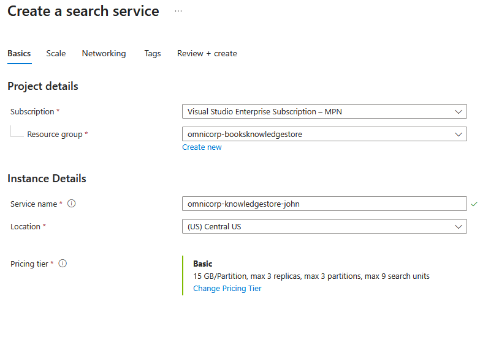
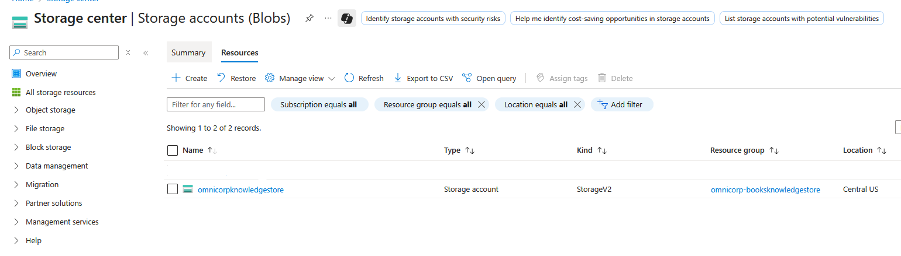
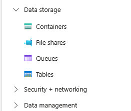

# OmniCorp Digital Library: Intelligent Book Discovery Platform

### Lab Overview

Azure AI Search provides powerful built-in cognitive skills for common AI tasks like sentiment analysis, key phrase extraction, and entity recognition. However, real-world business scenarios often require sophisticated processing that goes beyond these standard capabilities for large-scale data analytics and intelligent discovery systems.

**The Game-Changer: Azure Knowledge Store**

Traditional search solutions only provide query capabilities, but Azure Knowledge Store revolutionizes this by **permanently storing AI-enriched data** for advanced analytics and business intelligence. Unlike search indexes optimized for retrieval, Knowledge Store creates structured, analytics-ready datasets that preserve expensive cognitive processing results and enable sophisticated reporting.

In this comprehensive lab, you'll build an intelligent book discovery platform using **Azure AI Search with Knowledge Store capabilities**. The system will process a comprehensive catalog of **10,000+ books** with rich metadata including ratings, publication history, author information, and book cover images, while creating a persistent analytics layer for business insights.

**Knowledge Store enables you to:**
* **Preserve AI insights permanently** - sentiment analysis, themes, and entities stored for repeated use
* **Create structured analytics tables** - normalized data ready for Power BI, Excel, and business intelligence tools
* **Build comprehensive reports** - author productivity trends, publication patterns, and reader preference analytics
* **Enable cost-effective analytics** - process AI enrichment once, analyze unlimited times
* **Support real-time dashboards** - live business intelligence without re-processing data

**Business Challenge Addressed:**
Standard book catalogs lack intelligent discovery capabilities AND persistent analytics. Users struggle to find books matching their preferences, librarians need better tools for trend analysis, and management requires insights into reading patterns and author popularity across different time periods and genres. Most importantly, **traditional systems require expensive re-processing** for each analytical query, while Knowledge Store enables one-time AI processing with unlimited analytics access.

## Instructions

1. Download  Sample  `Books Data` Datasets:
   Navigate to  sample data sources:
   - Books data: [Azure Search Sample Data](https://github.com/Azure-Samples/azure-search-sample-data/blob/main/good-books/books.csv)
       
      
   
   
2. To Create Azure AI Search Resource access Azure Portal:
   - Navigate to [Azure Portal](https://portal.azure.com)
   - Sign in with your Azure subscription credentials

3. Search `AI Search ` service in the Azure Portal search bar:
   
      
   
4. Click `+ Create` to create a new AI search Service:
   
      

5. Configure with the following settings:
     ```
     Subscription: [Your Azure Subscription]
     Resource Group: [Create new] omnicorp-booksknowledgestore-rg
     Service Name: omnicorp-knowledgestore-[yourname][random]
     Location: East US (or available region)
     Pricing Tier: Basic (required for multiple data sources)
     ```
     

6. Click `Review + create`:
   
     

7. Then `Create` to create the service:
   
     


### Prepare the Storage Account 

1.  Azure Storage Account is alrady created for this lab, go to Azure Portal and in the Search bar search for `Storage accounts`:
     

         
2.  # Get the Storage account name from Lab Guidence page
    
      


3.  Let's create Containers to hold Hotel reviews and book data for the search:  Go to the  Storage accounts in azure portal and select the  Storage account that is created for you:

    

4.   In the leftside menu under `Data storage` select `Containers`:
   
     

5.   Click `+ Add container` to create the Hotels Container with following data:
   - Name:  `books-data`.
   - Set access level to `Container`.
  
     
6.   Upload the Downloaded  `books.csv` file from the Azure sample data repository. Click `Upload` :
    
     

7.  Browse for the downloaded file or drag and drop the file to upload:
   
     

8.  Click `Upload`:
    
     

10. Get Storage Account Connection String and keep this key safely for later usage. Go to Access keys under `Security + networking`:

     

11. Copy the complete `Connection string` from `key1`:
     
     
