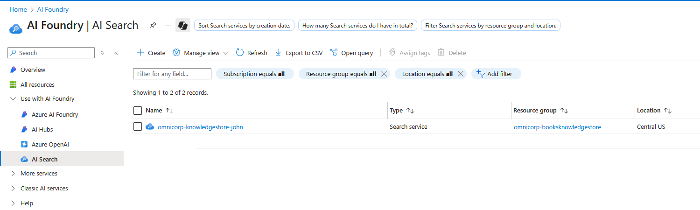
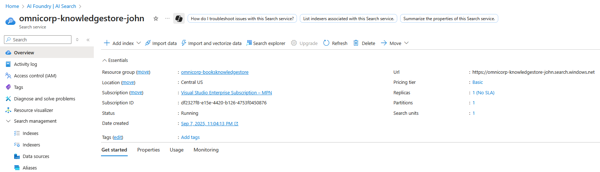
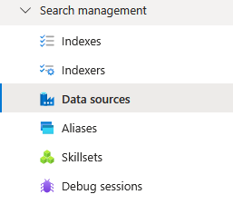
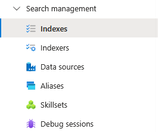
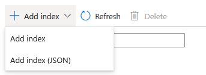
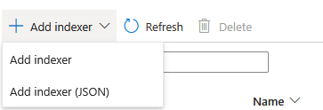
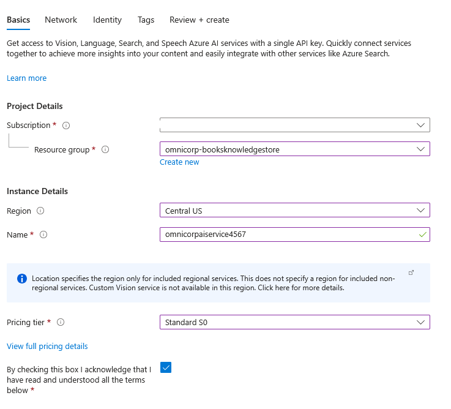
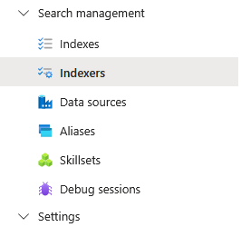
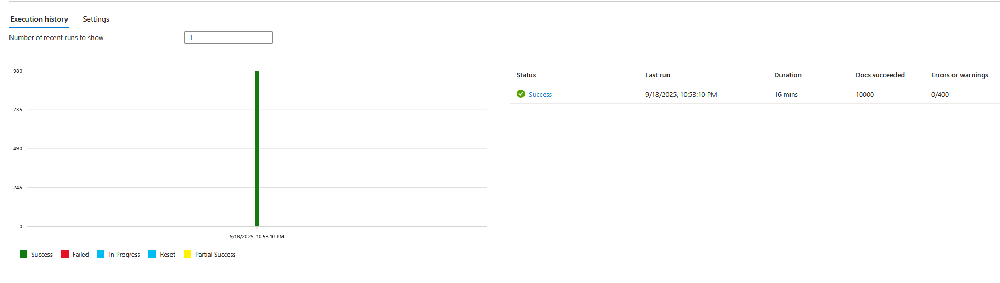

This exercise focuses on establishing the AI enrichment pipeline using Azure AI Search's built-in cognitive skills. You'll configure the data source to parse CSV books reviews,  design the search index schema, and run the indexer to process reviews.

## Instructions.

1. Navigate to your Azure AI Search resource. Search `AI Search` in Azure portal:
   
   

2. Select the `omnicorp-knowledgestore-john` Ai Search:
   
   

3. Click `Data sources` under `Search management` section:
   
   

4. Click `+ Add data source` and selct `Add data source` from the drop down list:
   
   

5. Configure Books Reviews Data Source:
   
      - Data Source: **Azure Blob Storage**
      - Name: `omnicorp-books-review`
      - Subscription: This will select LAB subscription.
      - Storage account: select the storage account created in step 01.
      - Blob container: select the Blob container used in step 01.
     
    
  


6. Click `Create` to create the Data Source:
   
   


7. Click `Indexes` under `Search management` section:
   
   


8.  Click on `+ Add index `and select `Add index(JSON)` from the drop down list:
   
   


9.  It will open JSON edit page and  replace the default content with following   complete index configuration:

```json
   {
  "@odata.etag": "\"0x8DDF6D56BFFE862\"",
  "name": "books-reviews-index",
  "defaultScoringProfile": "",
  "fields": [
    {
      "name": "book_id",
      "type": "Edm.String",
      "searchable": false,
      "filterable": true,
      "retrievable": true,
      "stored": true,
      "sortable": true,
      "facetable": false,
      "key": true,
      "synonymMaps": []
    },
    {
      "name": "goodreads_book_id",
      "type": "Edm.String",
      "searchable": false,
      "filterable": false,
      "retrievable": false,
      "stored": true,
      "sortable": false,
      "facetable": false,
      "key": false,
      "synonymMaps": []
    },
    {
      "name": "best_book_id",
      "type": "Edm.String",
      "searchable": false,
      "filterable": false,
      "retrievable": false,
      "stored": true,
      "sortable": false,
      "facetable": false,
      "key": false,
      "synonymMaps": []
    },
    {
      "name": "work_id",
      "type": "Edm.String",
      "searchable": false,
      "filterable": false,
      "retrievable": false,
      "stored": true,
      "sortable": false,
      "facetable": false,
      "key": false,
      "synonymMaps": []
    },
    {
      "name": "books_count",
      "type": "Edm.Int64",
      "searchable": false,
      "filterable": false,
      "retrievable": false,
      "stored": true,
      "sortable": false,
      "facetable": false,
      "key": false,
      "synonymMaps": []
    },
    {
      "name": "isbn",
      "type": "Edm.String",
      "searchable": true,
      "filterable": true,
      "retrievable": true,
      "stored": true,
      "sortable": false,
      "facetable": false,
      "key": false,
      "analyzer": "standard.lucene",
      "synonymMaps": []
    },
    {
      "name": "isbn13",
      "type": "Edm.String",
      "searchable": true,
      "filterable": true,
      "retrievable": true,
      "stored": true,
      "sortable": false,
      "facetable": false,
      "key": false,
      "analyzer": "standard.lucene",
      "synonymMaps": []
    },
    {
      "name": "authors",
      "type": "Edm.String",
      "searchable": true,
      "filterable": true,
      "retrievable": true,
      "stored": true,
      "sortable": true,
      "facetable": true,
      "key": false,
      "analyzer": "standard.lucene",
      "synonymMaps": []
    },
    {
      "name": "original_publication_year",
      "type": "Edm.String",
      "searchable": false,
      "filterable": true,
      "retrievable": true,
      "stored": true,
      "sortable": true,
      "facetable": true,
      "key": false,
      "synonymMaps": []
    },
    {
      "name": "original_title",
      "type": "Edm.String",
      "searchable": true,
      "filterable": false,
      "retrievable": true,
      "stored": true,
      "sortable": false,
      "facetable": false,
      "key": false,
      "analyzer": "standard.lucene",
      "synonymMaps": []
    },
    {
      "name": "title",
      "type": "Edm.String",
      "searchable": true,
      "filterable": false,
      "retrievable": true,
      "stored": true,
      "sortable": true,
      "facetable": false,
      "key": false,
      "analyzer": "standard.lucene",
      "synonymMaps": []
    },
    {
      "name": "language_code",
      "type": "Edm.String",
      "searchable": false,
      "filterable": true,
      "retrievable": true,
      "stored": true,
      "sortable": false,
      "facetable": true,
      "key": false,
      "synonymMaps": []
    },
    {
      "name": "average_rating",
      "type": "Edm.Double",
      "searchable": false,
      "filterable": true,
      "retrievable": true,
      "stored": true,
      "sortable": true,
      "facetable": true,
      "key": false,
      "synonymMaps": []
    },
    {
      "name": "ratings_count",
      "type": "Edm.Int64",
      "searchable": false,
      "filterable": true,
      "retrievable": true,
      "stored": true,
      "sortable": true,
      "facetable": true,
      "key": false,
      "synonymMaps": []
    },
    {
      "name": "work_ratings_count",
      "type": "Edm.Int64",
      "searchable": false,
      "filterable": false,
      "retrievable": false,
      "stored": true,
      "sortable": false,
      "facetable": false,
      "key": false,
      "synonymMaps": []
    },
    {
      "name": "work_text_reviews_count",
      "type": "Edm.Int64",
      "searchable": false,
      "filterable": true,
      "retrievable": true,
      "stored": true,
      "sortable": true,
      "facetable": false,
      "key": false,
      "synonymMaps": []
    },
    {
      "name": "ratings_1",
      "type": "Edm.Int64",
      "searchable": false,
      "filterable": true,
      "retrievable": true,
      "stored": true,
      "sortable": true,
      "facetable": false,
      "key": false,
      "synonymMaps": []
    },
    {
      "name": "ratings_2",
      "type": "Edm.Int64",
      "searchable": false,
      "filterable": true,
      "retrievable": true,
      "stored": true,
      "sortable": true,
      "facetable": false,
      "key": false,
      "synonymMaps": []
    },
    {
      "name": "ratings_3",
      "type": "Edm.Int64",
      "searchable": false,
      "filterable": true,
      "retrievable": true,
      "stored": true,
      "sortable": true,
      "facetable": false,
      "key": false,
      "synonymMaps": []
    },
    {
      "name": "ratings_4",
      "type": "Edm.Int64",
      "searchable": false,
      "filterable": true,
      "retrievable": true,
      "stored": true,
      "sortable": true,
      "facetable": false,
      "key": false,
      "synonymMaps": []
    },
    {
      "name": "ratings_5",
      "type": "Edm.Int64",
      "searchable": false,
      "filterable": true,
      "retrievable": true,
      "stored": true,
      "sortable": true,
      "facetable": false,
      "key": false,
      "synonymMaps": []
    },
    {
      "name": "image_url",
      "type": "Edm.String",
      "searchable": false,
      "filterable": false,
      "retrievable": true,
      "stored": true,
      "sortable": false,
      "facetable": false,
      "key": false,
      "synonymMaps": []
    },
    {
      "name": "small_image_url",
      "type": "Edm.String",
      "searchable": false,
      "filterable": false,
      "retrievable": true,
      "stored": true,
      "sortable": false,
      "facetable": false,
      "key": false,
      "synonymMaps": []
    },
    {
      "name": "AzureSearch_DocumentKey",
      "type": "Edm.String",
      "searchable": false,
      "filterable": false,
      "retrievable": true,
      "stored": true,
      "sortable": false,
      "facetable": false,
      "key": false,
      "synonymMaps": []
    },
    {
      "name": "metadata_storage_content_type",
      "type": "Edm.String",
      "searchable": false,
      "filterable": false,
      "retrievable": false,
      "stored": true,
      "sortable": false,
      "facetable": false,
      "key": false,
      "synonymMaps": []
    },
    {
      "name": "metadata_storage_size",
      "type": "Edm.Int64",
      "searchable": false,
      "filterable": false,
      "retrievable": false,
      "stored": true,
      "sortable": false,
      "facetable": false,
      "key": false,
      "synonymMaps": []
    },
    {
      "name": "metadata_storage_last_modified",
      "type": "Edm.DateTimeOffset",
      "searchable": false,
      "filterable": false,
      "retrievable": false,
      "stored": true,
      "sortable": false,
      "facetable": false,
      "key": false,
      "synonymMaps": []
    },
    {
      "name": "metadata_storage_content_md5",
      "type": "Edm.String",
      "searchable": false,
      "filterable": false,
      "retrievable": false,
      "stored": true,
      "sortable": false,
      "facetable": false,
      "key": false,
      "synonymMaps": []
    },
    {
      "name": "metadata_storage_name",
      "type": "Edm.String",
      "searchable": false,
      "filterable": false,
      "retrievable": false,
      "stored": true,
      "sortable": false,
      "facetable": false,
      "key": false,
      "synonymMaps": []
    },
    {
      "name": "metadata_storage_path",
      "type": "Edm.String",
      "searchable": false,
      "filterable": false,
      "retrievable": false,
      "stored": true,
      "sortable": false,
      "facetable": false,
      "key": false,
      "synonymMaps": []
    },
    {
      "name": "metadata_storage_file_extension",
      "type": "Edm.String",
      "searchable": false,
      "filterable": false,
      "retrievable": false,
      "stored": true,
      "sortable": false,
      "facetable": false,
      "key": false,
      "synonymMaps": []
    },
    {
      "name": "detected_language",
      "type": "Edm.String",
      "searchable": false,
      "filterable": true,
      "retrievable": true,
      "stored": true,
      "sortable": false,
      "facetable": true,
      "key": false,
      "synonymMaps": []
    },
    {
      "name": "key_phrases",
      "type": "Collection(Edm.String)",
      "searchable": true,
      "filterable": false,
      "retrievable": true,
      "stored": true,
      "sortable": false,
      "facetable": true,
      "key": false,
      "synonymMaps": []
    },
    {
      "name": "named_entities",
      "type": "Collection(Edm.String)",
      "searchable": true,
      "filterable": false,
      "retrievable": true,
      "stored": true,
      "sortable": false,
      "facetable": true,
      "key": false,
      "synonymMaps": []
    }
  ],
  "scoringProfiles": [],
  "suggesters": [],
  "analyzers": [],
  "normalizers": [],
  "tokenizers": [],
  "tokenFilters": [],
  "charFilters": [],
  "similarity": {
    "@odata.type": "#Microsoft.Azure.Search.BM25Similarity"
  }
}

```

11. Click `Save` to save the Configuration:

      


## Create Cognitive Skillset for Book Analysis
Build an AI processing pipeline through JSON configuration that extracts key phrases, recognizes entities, detects languages, and analyzes book content for enhanced searchability and insights.
Cognitive skills transform basic book metadata into intelligent, enriched content. These AI capabilities enable theme extraction, author recognition, and content analysis that powers sophisticated search and recommendation features.


11. In Azure AI Search, click `Skillsets` in the left menu:
   
      
   
12. Click `+ Add skillset`:
   
      

13. Click `Connect AI service` to create Azure AI services multi-service account:
   
      

14. Click on `+ Create new AI service`: 
   
      

15. Fill the details required for  resource creation as follow:
    
      * Resource name: omnicorpaiservice
      * Resource group: `Select the Resource Group for this LAB`
      * Region: Same as your Search service
      * Pricing tier: Standard S0
  
      

16. Click `Review + Create` to create the Resource:
     
      

17. Go back to JSON edit page and  replace the default content with this complete skillset configuration: 
    
   ``` json
  {
     {
     "name": "books-intelligence-skillset",
     "description": "Comprehensive AI analysis for book catalog",
     "skills": [
       {
         "@odata.type": "#Microsoft.Skills.Text.SplitSkill",
         "name": "split-book-content",
         "description": "Split book content for processing",
         "context": "/document",
         "defaultLanguageCode": "en",
         "textSplitMode": "pages",
         "maximumPageLength": 1000,
         "inputs": [
           {
             "name": "text",
             "source": "/document/title"
           }
         ],
         "outputs": [
           {
             "name": "textItems",
             "targetName": "pages"
           }
         ]
       },
       {
         "@odata.type": "#Microsoft.Skills.Text.KeyPhraseExtractionSkill",
         "name": "extract-book-themes",
         "description": "Extract key themes from book titles and content",
         "context": "/document/pages/*",
         "defaultLanguageCode": "en",
         "inputs": [
           {
             "name": "text",
             "source": "/document/pages/*"
           }
         ],
         "outputs": [
           {
             "name": "keyPhrases",
             "targetName": "keyphrases"
           }
         ]
       },
       {
         "@odata.type": "#Microsoft.Skills.Text.V3.EntityRecognitionSkill",
         "name": "recognize-book-entities",
         "description": "Recognize entities in book data using V3 API",
         "context": "/document/pages/*",
         "inputs": [
           {
             "name": "text",
             "source": "/document/pages/*"
           }
         ],
         "outputs": [
           {
             "name": "namedEntities",
             "targetName": "namedEntities"
           }
         ]
       },
       {
         "@odata.type": "#Microsoft.Skills.Text.LanguageDetectionSkill",
         "name": "detect-book-language",
         "description": "Detect language of book content",
         "context": "/document",
         "inputs": [
           {
             "name": "text",
             "source": "/document/title"
           }
         ],
         "outputs": [
           {
             "name": "languageCode",
             "targetName": "detectedLanguage"
           }
         ]
       }
     ],
     "cognitiveServices": {},
     "knowledgeStore": {
       "storageConnectionString": "YOUR_STORAGE_CONNECTION_STRING_HERE",
       "projections": [
         {
           "tables": [
             {
               "tableName": "BooksAnalytics",
               "sourceContext": "/document",
               "generatedKeyName": "BookAnalyticsId",
               "inputs": [
                 {
                   "name": "book_id",
                   "source": "/document/book_id"
                 },
                 {
                   "name": "title",
                   "source": "/document/title"
                 },
                 {
                   "name": "authors",
                   "source": "/document/authors"
                 },
                 {
                   "name": "average_rating",
                   "source": "/document/average_rating"
                 },
                 {
                   "name": "ratings_count",
                   "source": "/document/ratings_count"
                 },
                 {
                   "name": "publication_year",
                   "source": "/document/original_publication_year"
                 },
                 {
                   "name": "language_code",
                   "source": "/document/language_code"
                 }
               ]
             }
           ]
         },
         {
           "tables": [
             {
               "tableName": "BookRatingsBreakdown",
               "sourceContext": "/document",
               "generatedKeyName": "RatingsId",
               "inputs": [
                 {
                   "name": "book_id",
                   "source": "/document/book_id"
                 },
                 {
                   "name": "title",
                   "source": "/document/title"
                 },
                 {
                   "name": "authors",
                   "source": "/document/authors"
                 },
                 {
                   "name": "ratings_1",
                   "source": "/document/ratings_1"
                 },
                 {
                   "name": "ratings_2",
                   "source": "/document/ratings_2"
                 },
                 {
                   "name": "ratings_3",
                   "source": "/document/ratings_3"
                 },
                 {
                   "name": "ratings_4",
                   "source": "/document/ratings_4"
                 },
                 {
                   "name": "ratings_5",
                   "source": "/document/ratings_5"
                 }
               ]
             }
           ]
         },
         {
           "objects": [
             {
               "storageContainer": "enriched-books-objects",
               "source": "/document"
             }
           ]
         }
       ]
     }
   }
   ```

 

   **Replace the placeholder values with your actual keys and connections:
   Replace this:**

   * Replace `"YOUR_STORAGE_CONNECTION_STRING_HERE"` with the Connection string copied from the previous step.
   * Again Click `Connect AI service` to create Azure AI services multi-service account:
         
      * Click Refresh and select `omnicorpAiService` that we created previously. This will add ,
   ``` JSON
         cognitiveServices": {
         "@odata.type": "#Microsoft.Azure.Search.AIServicesByKey",
         "key": "<redacted>",
         "subdomainUrl": "https://omnicorpaiservice.cognitiveservices.azure.com/"
   },
   ```

18.    Click `Save` to create the skillset:
   
   

---


##  Create and Configure Book Catalog Indexer

19. In Azure AI Search, click `Indexers` in the left menu:
   
   

2. Click `+ Add indexer` and select `Add indexer(JSON)`:
   
   

3. It will open JSON edit page and  replace the default content with following complete indexer configuration:

```json
   {
  "@odata.context": "https://omnicorp-knowledgestore-john.search.windows.net/$metadata#indexers/$entity",
  "@odata.etag": "\"0x8DDF6D5BAB0AF67\"",
  "name": "indexer3",
  "description": null,
  "dataSourceName": "omnicorp-books-review2",
  "skillsetName": "books-intelligence-skillset-complete",
  "targetIndexName": "books-reviews-index3",
  "disabled": null,
  "schedule": null,
  "parameters": {
    "batchSize": 100,
    "maxFailedItems": 50,
    "maxFailedItemsPerBatch": 10,
    "configuration": {
      "indexedFileNameExtensions": ".csv",
      "dataToExtract": "contentAndMetadata",
      "parsingMode": "delimitedText",
      "firstLineContainsHeaders": true,
      "delimitedTextDelimiter": ",",
      "imageAction": "none"
    }
  },
  "fieldMappings": [],
  "outputFieldMappings": [
    {
      "sourceFieldName": "/document/detectedLanguage",
      "targetFieldName": "detected_language",
      "mappingFunction": null
    },
    {
      "sourceFieldName": "/document/keyphrases",
      "targetFieldName": "key_phrases",
      "mappingFunction": null
    },
    {
      "sourceFieldName": "/document/namedEntities",
      "targetFieldName": "named_entities",
      "mappingFunction": null
    }
  ],
  "cache": {
    "id": "5f443f36-a831-4ad9-a755-32b604e7fee5",
    "enableReprocessing": true,
    "storageConnectionString": "<redacted>",
    "identity": null
  },
  "encryptionKey": null
   }
```
   
 
1. Click `Save` to create the indexer:
   
   

---

##  Execute Book Catalog Indexing

1. Navigate to the `Indexers` section and select `books-catalog-indexer`:
   
   

2. Click `Run` to start processing the comprehensive book catalog:
   
   

3. Monitor the indexing progress in the `Execution History`:
   - Processing time: 15-30 minutes for 10,000+ books
   - Watch for successful document processing count
   - Monitor any errors or warnings
   
   

4. Verify successful completion when status shows `Success`:
   
   

---