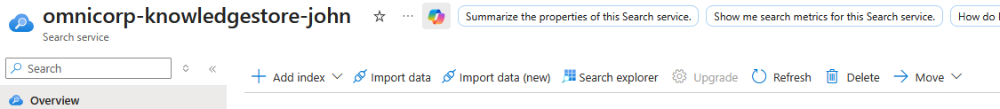
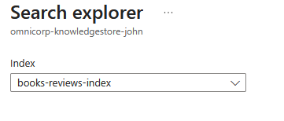
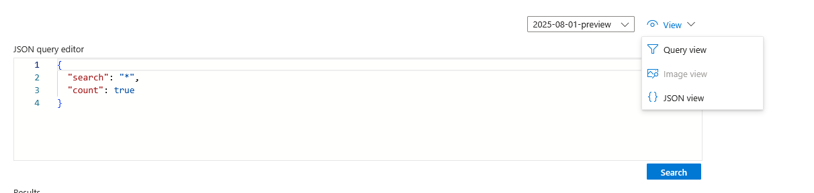

Validate the search functionality by testing queries for book discovery, author analysis, and rating-based filtering to ensure the indexing worked properly.
Testing proves the search solution works as intended and demonstrates the capabilities enabled by our comprehensive book catalog processing.

## Instructions.

1. Navigate to **Search explorer** in your Azure AI Search service:
   
   

2. Select the **books-reviews-index**:
   
   

3. Set the `View` to `{ } JSON view`:

   

4. Test comprehensive book discovery queries:

   **Query 1: Verify all books are indexed**
   ```json
      {
      "search": "*",
      "count": true,
      "top": 0
      }

   ```

   output :
   ```json
      {
   "@odata.context": "https://omnicorp-knowledgestore-john.search.windows.net/indexes('books-reviews-index')/$metadata#docs(*)",
   "@odata.count": 9999,
   "value": []
   }
   ```

   **Query 2: Test book discovery by title:**
   ```json
      {
      "search": "Harry Potter",
      "select": "title,authors,average_rating,ratings_count",
      "highlight": "title,authors",
      "top": 5
      }

   ```
   output:
   ```json
      "value": [
    {
      "@search.score": 29.482872,
      "@search.highlights": {
        "title": [
          "<em>Harry</em> <em>Potter</em> Collection (<em>Harry</em> <em>Potter</em>, #1-6)"
        ]
      },
      "authors": "J.K. Rowling",
      "title": "Harry Potter Collection (Harry Potter, #1-6)",
      "average_rating": 4.73,
      "ratings_count": 24618
    },
    {...
   ```

   **Query 3: High-rated books analysis:**
   ```json
      {
      "search": "*",
      "filter": "average_rating ge 4.5 and ratings_count ge 10000",
      "select": "title,authors,average_rating,ratings_count,original_publication_year",
      "orderby": "ratings_count desc",
      "top": 20
      }

   ```
   output:
   ```json
   {
      "@search.score": 1,
      "authors": "J.K. Rowling, Mary GrandPré, Rufus Beck",
      "original_publication_year": "1999",
      "title": "Harry Potter and the Prisoner of Azkaban (Harry Potter, #3)",
      "average_rating": 4.53,
      "ratings_count": 1832823
    },
    {
      "@search.score": 1,
      "authors": "J.K. Rowling, Mary GrandPré",
      "original_publication_year": "2000",
      "title": "Harry Potter and the Goblet of Fire (Harry Potter, #4)",
      "average_rating": 4.53,
      "ratings_count": 1753043
    },
    {...
   ```

   **Query 4: Author popularity with faceting:**

   ```json
   {
      "search": "*",
      "facets": ["authors,count:20", "original_publication_year,count:20"],
      "filter": "ratings_count ge 1000",
      "top": 10
   }
   ```
   output:

   ```json

         "authors": [
         {
         "value": "Nora Roberts",
         "count": 56
         },
         {
         "value": "Stephen King",
         "count": 56
         },
         {
         "value": "Dean Koontz",
         "count": 45
         },
         {...

   ```

   ***Verify search results show proper book data and faceting works correctly:***


## View the Knowledge Store Data

 Explore the persistent analytics data created by your indexer to verify that AI insights are properly stored in structured formats for business intelligence and reporting. This validates that the knowledge store successfully captured and organized AI-enriched book data into queryable formats, demonstrating the foundation for ongoing analytics without expensive re-processing.

After you have run the `books-catalog-indexer` that uses the `books-intelligence-skillset-complete` to create a knowledge store, the enriched data extracted by the indexing process is persisted in the knowledge store projections. The object projections defined in your books intelligence skillset consist of JSON files for each indexed book document. These files are stored in a blob container in the Azure Storage account.

The ability to create object projections like this enables you to generate enriched book data objects that can be incorporated into an enterprise data analysis solution - for example by ingesting the JSON files into an Azure Data Factory pipeline for further processing or loading into a data warehouse.


## Validate Knowledge Store Success
What you should observe:

* **Object projections**: JSON files with complete book records and AI insights
* **Table projections**: BooksAnalytics and BookRatingsBreakdown tables populated
* **AI enrichments**: detected_language, key_phrases, named_entities fields populated
* **Data completeness**: ~10,000 records across tables
* **Analytics readiness**: Structured data ready for Power BI, Excel, or other BI tools

The ability to create table projections enables you to build analytical and reporting solutions that query the relational schema; for example, using Microsoft Power BI, Excel Online, or Azure Synapse Analytics. The automatically generated key columns can be used to join the tables in queries - for example to return all AI-extracted themes for books by a specific author, or to analyze sentiment patterns across different publication periods.
The knowledge store has successfully transformed your raw book catalog into an intelligent analytics platform that preserves AI processing results and enables sophisticated business intelligence without re-processing costs.


## Lab Completion Summary
Congratulations! You have successfully completed the Azure AI Search with Knowledge Store lab for intelligent book discovery. This comprehensive lab demonstrated:
Key Achievements:


Technical Skills Mastered:

* Azure AI Search configuration and optimization for large datasets
* Cognitive skillsets implementation with JSON-based configuration
* Knowledge store design with table and object projections
* Advanced search query patterns for intelligent discovery
* Multi-service Azure integration (AI Services, Storage, Search)
* Enterprise data processing and enrichment pipeline development
